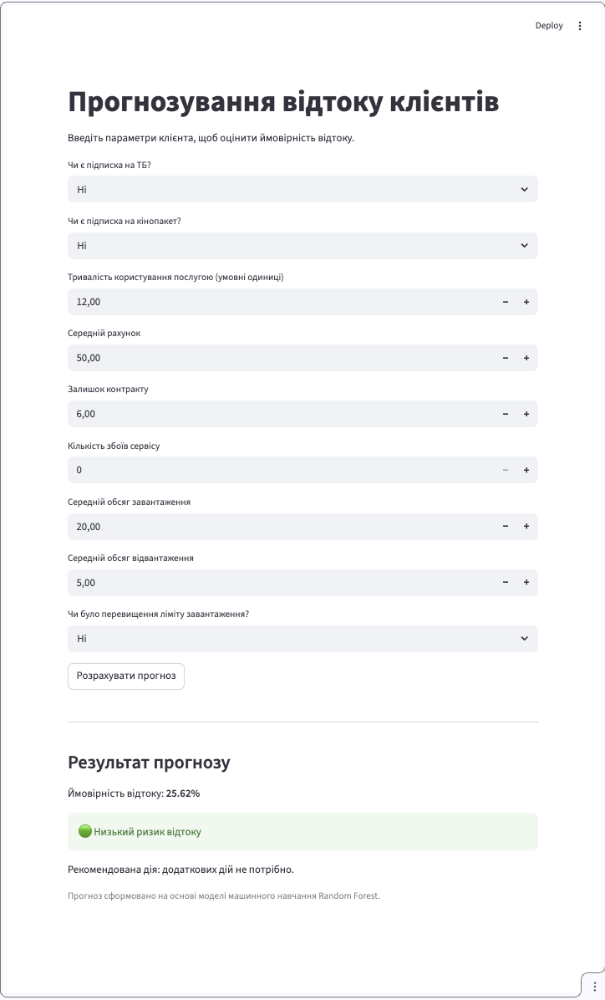

# Telecom Churn Prediction

## 📌 Project Overview
This project focuses on predicting customer churn for a telecom company using machine learning.

The goal is to identify customers who are likely to stop using the service and enable proactive retention strategies.

---

## 🧠 Business Problem
Customer churn is a major challenge for telecom companies.

Acquiring new customers is significantly more expensive than retaining existing ones.

This model helps:
- identify high-risk customers
- take preventive actions (discounts, engagement campaigns)
- reduce revenue loss

---

## 📊 Dataset
- ~72,000 customers
- Features include:
  - subscription details
  - usage statistics
  - contract information
  - service quality metrics

Target variable:
- `churn` (1 = customer left, 0 = stayed)

---

## ⚙️ Data Preprocessing
- Missing values handled using **median imputation**
- Column `'reamining_contract'` corrected to `'remaining_contract'`
- Irrelevant column `'id'` removed
- Feature scaling applied using **StandardScaler**
- Train/test split performed with **stratification**

---

## 🤖 Model
**Random Forest Classifier**

### Why this model:
- handles non-linear relationships
- robust to noise and outliers
- provides feature importance for interpretability

---

## 📈 Model Evaluation

| Metric   | Value |
|----------|------|
| Accuracy | 0.94 |
| F1-score | 0.94 |
| ROC-AUC  | 0.97 |

The model demonstrates strong performance in detecting churn cases, with high recall ensuring that most at-risk customers are identified.

---

## 🔍 Key Insights
- **Remaining contract** is the strongest predictor
- Customers with longer contracts are significantly less likely to churn
- Higher usage (download/upload) correlates with lower churn
- Additional services (TV, movies) reduce churn risk

---

## 🧠 Business Logic

Based on predicted churn probability:

- 🔴 **High risk (>70%)** → Offer retention discount  
- 🟡 **Medium risk (40–70%)** → Engagement campaign  
- 🟢 **Low risk (<40%)** → No action required  

---

## 🖥️ User Interface (Streamlit)

An interactive web application allows users to:
- input customer data
- receive churn prediction
- view probability and recommended action
## 📷 Demo


---

## 🚀 How to Run

### Run locally
```bash
pip install -r requirements.txt
streamlit run app/app.py
```
### 🐳 Run with Docker
```
docker build -t churn-app .
docker run -p 8501:8501 churn-app
```
Then open:

http://localhost:8501

### 📊 Example

Input:

TV: Yes\
Movie package: Yes\
Subscription age: 12\
Remaining contract: 6

Output:

Churn probability: 25%\
Risk: Low

## 🧱 Project Structure
```commandline
telecom_churn_prediction/
│
├── data/
│   └── raw/
│       └── internet_service_churn.csv
│ 
├── src/
│   ├── data_preprocessing.py
│   ├── train.py
│   └── predict.py
│
├── models/
│   ├── model.pkl
│   ├── scaler.pkl
│   ├── imputer.pkl
│   └── features.pkl
│
├── app/
│   └── app.py
│
├── notebooks/
│   └── eda.ipynb
│
├── README.md
├── requirements.txt
├── Dockerfile
└── .gitignore
```
---
## 🧠 Skills Demonstrated
- Data analysis (EDA)
- Data preprocessing & feature engineering
- Machine learning (Random Forest)
- Model evaluation & metrics
- Inference pipeline design
- UI development (Streamlit)
- Debugging & system design
- Docker containerization
---
## 📌 Future Improvements
- XGBoost / LightGBM
- Hyperparameter tuning
- SHAP explainability
- REST API (FastAPI)
- Model monitoring
---